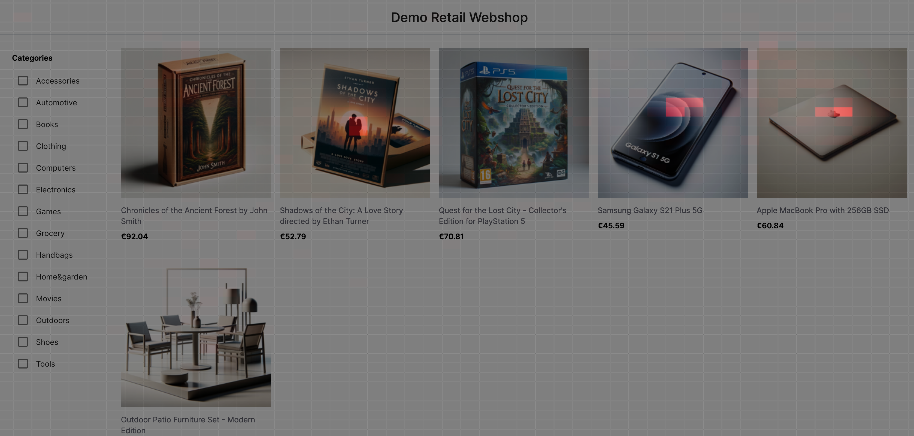

# Clickstream Analytics Template

This is a template application which displays realtime data analytics of customer activity on a website. The pink boxes show which products have the most attention at that point.

The pipeline collects data from a fictional e-commerce web page and aggregates all users' mouse coordinates to produce a heat map with the data gathered four times a second. The heatmap is then overlayed on the original site for admins to see a vizualisation of the 'hottest' areas on each page.

## Getting Started

To get started with the Quix Clickstream Analytics Template, follow these steps:

1. **Fork this Repository:** Start by forking this repository to your GitHub account. This will create a copy of the template that you can customize to suit your needs, or just to play around with!

2. **Configure Quix:** Connect the template to your Quix account and configure the necessary settings. Check out the [docs](https://quix.io/docs/create/fork-project.html) for step-by-step instructions to guide you through the setup process. 

